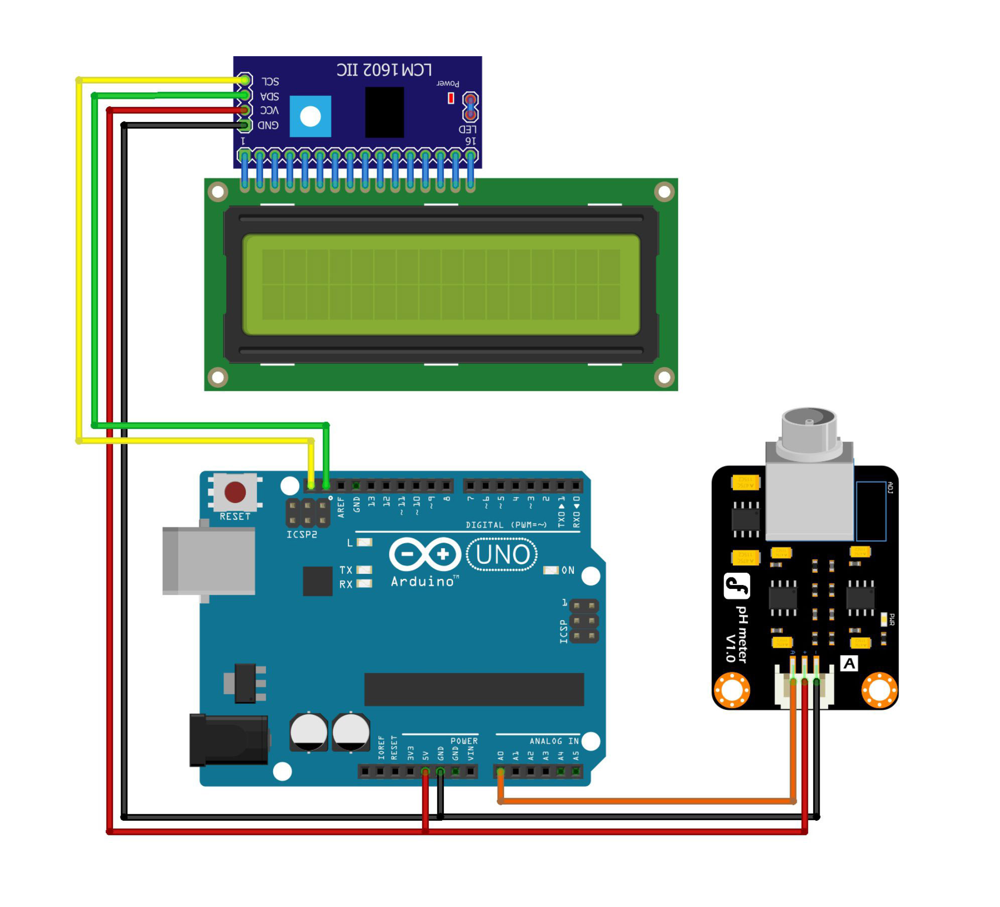

# Monitoring the pH of Hydroponic Plant Water

This project demonstrates a pH monitoring system for hydroponic plant water using an Arduino. The system reads the pH level of the water and displays it on an LCD screen. The pH sensor is calibrated to provide accurate pH readings based on voltage measurements.

## Components Used

- **Arduino IDE**
- **Library: LiquidCrystal_I2C**
- **Arduino Uno** (or compatible board) - 1 Unit
- **pH Module Sensor** - 1 Unit
- **LiquidCrystal_I2C LCD (16x2)** - 1 Unit
- **Project Board / BreadBoard** - 1 Unit
- **Jumper Wires**
- **Power Supply** (for Arduino and other components)

## Schematic

Below you can see a schematic image to facilitate the wiring of cables from the microcontroller to devices, both input and output sensors:



## Circuit Diagram

### Wiring Instructions

- **pH Sensor:**
  - **Signal Pin** to Analog Pin A0 on the Arduino
  - **VCC** to 5V
  - **GND** to GND
- **LCD (16x2) I2C:**
  - **SDA I2C** to pin A4 on the Arduino
  - **SCL I2C** to pin A5 on the Arduino
  - **VCC I2C** to 5V
  - **GND I2C** to GND

## How It Works

- The pH sensor measures the voltage corresponding to the pH level of the water.
- The analog voltage is converted to a pH value using calibration constants.
- The pH value is displayed on the LCD screen for easy monitoring.

## Code Explanation

- **Sensor Initialization:** The pH sensor is connected to analog pin A0.
- **Voltage Conversion:** The analog sensor value is converted to voltage.
- **pH Calculation:** The pH level is calculated using calibration values and the measured voltage.
- **LCD Display:** The calculated pH value is displayed on the LCD screen.

```cpp
#include <LiquidCrystal_I2C.h>      // Library for LCD I2C
LiquidCrystal_I2C lcd(0x27, 16, 2); // I2C Address

#define SensorpH A0                 // pH Sensor on pin A0

float teganganPh7 = 2.73;   // Calibration value for pH 7
float teganganPh4 = 3.3;    // Calibration value for pH 4
float Po;

void setup() {
  lcd.init();       // Initialize LCD
  lcd.backlight();  // Turn on backlight
}

void loop() {
  int sensorValue = analogRead(SensorpH);         // Read sensor value
  float voltage = sensorValue * (5.0 / 1023.0);   // Convert to voltage
  // Calculate pH
  Po = 7.00 + ((teganganPh7 - voltage) / ((teganganPh4 - teganganPh7)/3));
  lcd.setCursor(0, 0);
  lcd.print("pH Value = ");
  lcd.print(Po);                             // Display pH value
  delay(1000);
  lcd.clear();
}
```

## Installation

1. Gather all components listed above.
2. Connect the components following the wiring instructions.
3. Open the Arduino IDE and connect your Arduino board.
4. Copy the provided code into the Arduino IDE.
5. Upload the code to your Arduino Uno.

## Usage

- The system continuously monitors the pH level of the hydroponic plant water.
- The pH value is updated and displayed on the LCD screen every second.

## Conclusion

- The Monitoring the pH of Hydroponic Plant Water project provides a simple and effective way to keep track of the pH level in hydroponic systems. Accurate pH monitoring ensures optimal conditions for plant growth.
- We can monitor the pH of hydroponic plants via LCD screen. The LCD screen that we use will displays the pH level of water in hydroponic plants in real time, so we can adjust the pH so that stable right then and there.

#### @Copyright 2024 | Monitoring-the-pH-of-Hydroponic-Plant-Water
